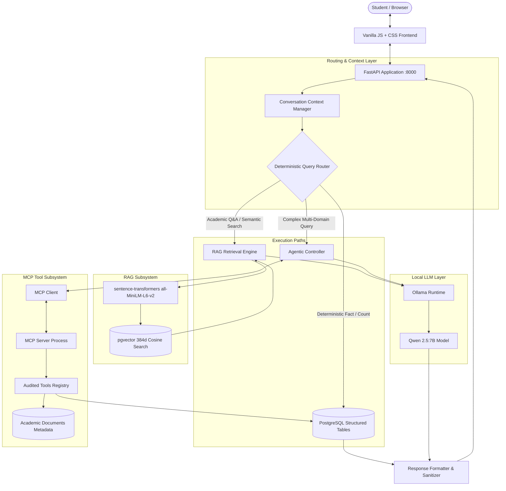
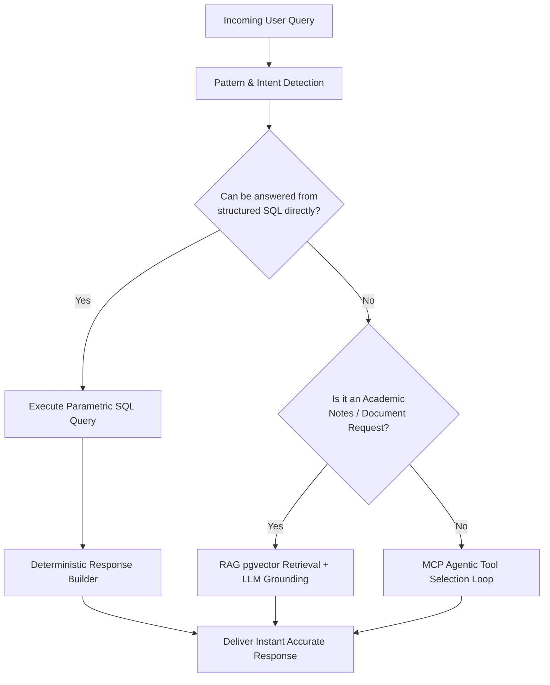
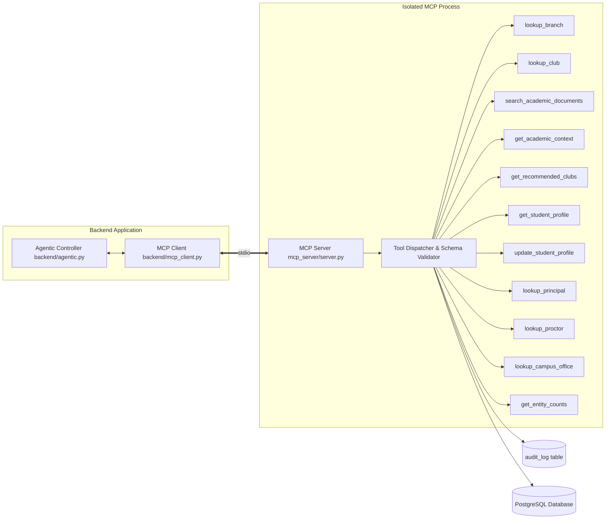
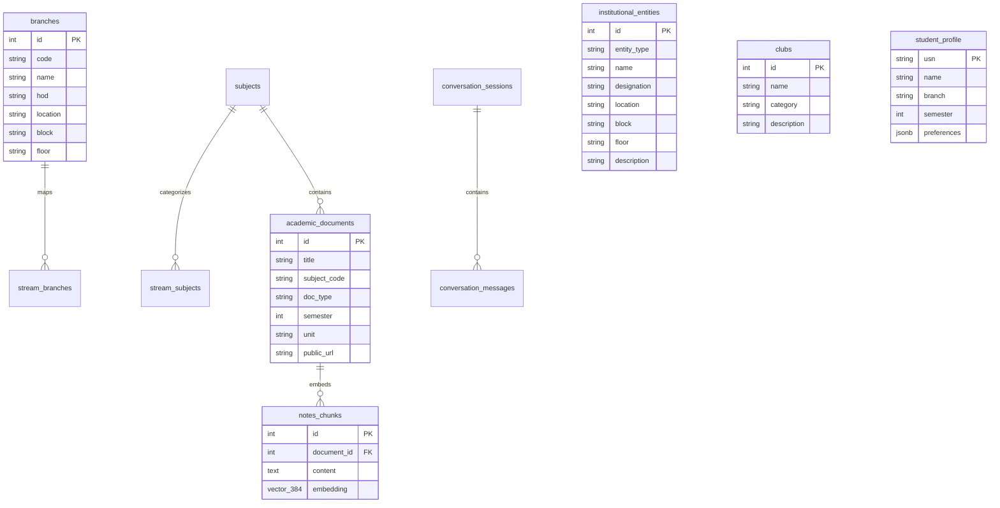
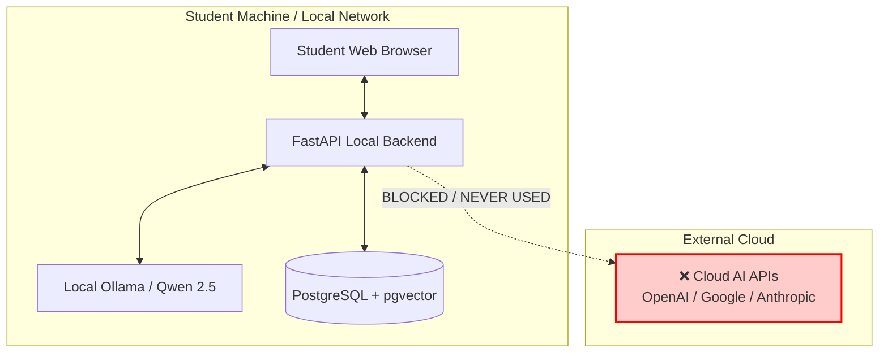
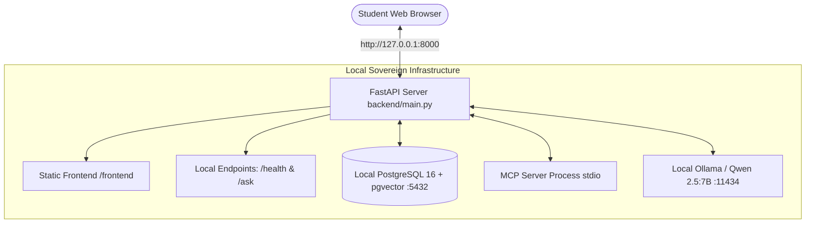
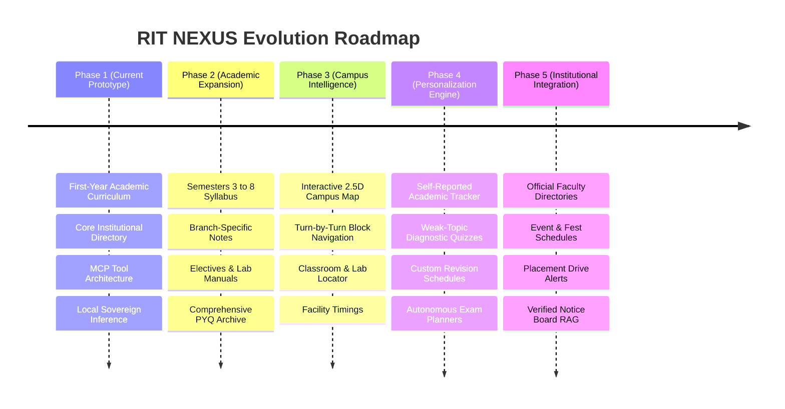

# RIT NEXUS

> **Sovereign AI for MSRIT Students**  
> *Developed for ASYNC'26 — Track 1: Sovereign AI*

[](https://async.msrit.edu)
[](#sovereign-ai-philosophy)
[-success.svg)](#local-llm-architecture)
[](#postgresql--pgvector-knowledge-layer)
[-blueviolet.svg)](#mcp-architecture)
[](#current-prototype-scope)

---

## Table of Contents

1. [Project Overview](#project-overview)
2. [The Problem](#the-problem)
3. [The Solution](#the-solution)
4. [Key Features](#key-features)
5. [Architecture Overview](#architecture-overview)
6. [End-to-End Request Flow](#end-to-end-request-flow)
7. [Deterministic Query Routing](#deterministic-query-routing)
8. [RAG Architecture](#rag-architecture)
9. [MCP (Model Context Protocol) Architecture](#mcp-model-context-protocol-architecture)
10. [Local LLM Architecture](#local-llm-architecture)
11. [PostgreSQL + pgvector Knowledge Layer](#postgresql--pgvector-knowledge-layer)
12. [Student Memory vs Conversation Memory](#student-memory-vs-conversation-memory)
13. [Institutional Knowledge](#institutional-knowledge)
14. [Academic Knowledge & Document Retrieval](#academic-knowledge--document-retrieval)
15. [Agentic Tool Execution](#agentic-tool-execution)
16. [Privacy & Security Design](#privacy--security-design)
17. [Deployment Architecture](#deployment-architecture)
18. [Technology Stack](#technology-stack)
19. [Repository Structure](#repository-structure)
20. [Local Setup & Installation](#local-setup--installation)
21. [Running the Application](#running-the-application)
22. [Example Queries](#example-queries)
23. [Testing & Reliability](#testing--reliability)
24. [Current Prototype Scope](#current-prototype-scope)
25. [Future Roadmap](#future-roadmap)
26. [Sovereign AI Philosophy](#sovereign-ai-philosophy)
27. [Data & Source Attribution](#data--source-attribution)
28. [Team & Hackathon Information](#team--hackathon-information)
29. [Summary](#summary)

---

## Project Overview

**RIT NEXUS** is a local-first, institution-specific sovereign AI assistant built specifically for the students, faculty, and academic community of **Ramaiah Institute of Technology (MSRIT)**. It unifies academic study material retrieval, institutional knowledge, student personalization, and multi-turn conversational reasoning into a single conversational interface.

Unlike generic cloud chatbots that rely on proprietary remote APIs, RIT NEXUS runs its language models, embedding pipelines, vector search, relational knowledge, and tool execution entirely on controlled local infrastructure.

> [!IMPORTANT]
> **Prototype Scope**: The current system is a working MVP / prototype developed for **ASYNC'26**. The academic resource and curriculum index is currently curated for **First-Year engineering streams** (Physics, Chemistry, Mathematics, Programming in C, and Civil Engineering), paired with core institutional data (departments, leadership, campus administrative offices, and student clubs). Multi-year curricula, live timetables, and campus-wide navigation are part of the future roadmap.

---

## The Problem

Engineering students face severe information fragmentation:
- **Scattered Academic Material**: Lecture notes, unit summaries, and previous-year question papers (PYQs) are spread across WhatsApp groups, Google Drive folders, student portals, and unofficial repositories.
- **Lost Institutional Context**: Locating department offices, Head of Department (HOD) details, campus administrative authorities (Principal, Chief Proctor, Examination Cell), and student clubs requires navigating outdated portals or word-of-mouth directions.
- **Cloud Dependency & Data Leakage**: Standard generative AI tools send student study habits, personal academic profiles, and queries to external cloud providers, lacking institutional grounding and hallucinating college-specific policies.
- **High Hallucination Rates in Generalist LLMs**: Generic models invent campus details, mix up department blocks, or produce generic academic answers disconnected from the MSRIT VTU/autonomous syllabus.

---

## The Solution

RIT NEXUS introduces a **sovereign, deterministic-first AI architecture**:
1. **100% Local Inference**: Zero cloud AI APIs. Local Ollama (`qwen2.5:7b`) and local sentence-transformers eliminate cloud subscription costs and data exfiltration.
2. **Deterministic-First Routing**: High-confidence institutional queries (HOD lookups, office locations, club directories, entity counts) bypass the LLM entirely and execute in milliseconds directly against PostgreSQL, eliminating hallucinations and latency.
3. **Hybrid RAG & Document Indexing**: Semantic vector retrieval (`pgvector` + `all-MiniLM-L6-v2`) combined with structured document discovery provides exact syllabus-grounded academic retrieval.
4. **Audited Agentic Tools via MCP**: Complex multi-domain queries invoke structured tools through the Model Context Protocol (MCP) with schema validation, closed tool registries, and execution audit logging.
5. **Dual-Tier Memory**: Cleanly isolates persistent student profile attributes (degree, branch, semester) from ephemeral conversational context (pronoun resolution, active entity tracking, follow-up candidate selection).

---

## Key Features

- 🏛️ **Institutional Directory**: Comprehensive lookup of departments, HODs, building blocks, floors, campus offices (Principal, Proctor, Accounts, Exam Cell), and student clubs.
- 📚 **First-Year Academic Library**: Direct retrieval and RAG question answering across First-Year Mathematics, Physics, Chemistry, C Programming, and Civil Engineering (notes, PYQs, syllabus, lab manuals).
- ⚡ **Zero-Latency Deterministic Routing**: Instant query classification that resolves counts, lists, and direct attribute queries without waiting for LLM generation.
- 🔄 **Conversational Pronoun & Entity Resolution**: Maintains short-term conversational context across turns (e.g., *"Who is the HOD of ECE?"* &rarr; *"Where is that department?"* &rarr; *"Who is its proctor?"*).
- 🔒 **Data Privacy & Path Sanitization**: Internal filesystem storage paths are strictly sanitized; public-facing cards output secure, validated web links (`ritnotebook.pages.dev`).
- 🛠️ **Model Context Protocol (MCP)**: Implements standard MCP client/server architecture for audited, bounded tool execution with maximum loop safeguards.
- 👤 **Persistent Student Profile**: Remembers student USN, semester, branch, and preferences across sessions to tailor responses without re-prompting.

---

## Architecture Overview

RIT NEXUS separates presentation, deterministic routing, semantic retrieval, tool execution, and local language synthesis into decoupled layers:



---

## End-to-End Request Flow

When a student submits a prompt through the interface, the request moves through a predictable, guarded lifecycle:

1. **Ingress & Session Tracking**: FastAPI receives `POST /ask` with `message`, `user_id`, and `session_id`.
2. **Context Resolution**: The `ConversationContextManager` pulls recent conversation history from PostgreSQL (`conversation_messages`). Ambiguous pronouns (*"he"*, *"it"*, *"that department"*, *"his office"*) and academic references (*"unit 1"*, *"2023 question paper"*) are mapped to active entities from prior turns.
3. **Intent Classification & Response Mode**:
   - `classify_intent()` classifies the query into categories (`department`, `principal`, `proctor`, `campus_office`, `entity_counts`, `club`, `academic`, `document_retrieval`, `identity`, `memory_query`, `memory_update`).
   - `detect_response_mode()` identifies the exact information format requested: `COUNT_ONLY`, `LIST_ONLY`, `COUNT_AND_LIST`, `ATTRIBUTE_ONLY`, `DETAIL`, `FOLLOWUP`, or `SEARCH`.
4. **Execution Routing**:
   - **Path A (Deterministic Fact)**: If the query matches structured institutional records (e.g., *"How many branches are there?"*, *"Who is the HOD of AI & ML?"*, *"Where is the Proctor office?"*), data is retrieved directly from PostgreSQL and formatted deterministically. **Latency: < 15ms. LLM invocations: 0.**
   - **Path B (Academic Retrieval / RAG)**: If the query asks for study material, previous papers, or syllabus explanations, `DocumentService` queries `academic_documents` and `RAGService` queries `notes_chunks` via cosine vector search. Retrieved chunks are grounded into a strict system prompt and synthesized by local `qwen2.5:7b`.
   - **Path C (Agentic Tool Selection)**: If the query is multi-faceted or requires multi-step reasoning, `AgenticEngine` initiates a bounded tool-use loop via `mcp_client.py`, calling registered MCP tools before synthesizing the final answer.
5. **Path Sanitization & Response Delivery**: Internal server file paths (`data/raw/...`, Windows backslashes, absolute storage locations) are sanitized into student-accessible public notebook links. The response is saved to PostgreSQL and returned via JSON.

---

## Deterministic Query Routing

A cornerstone of the RIT NEXUS architecture is **Deterministic-First Routing**. Generalist AI assistants route every query through a Large Language Model, incurring high latency, GPU overhead, and frequent hallucinations on simple factual queries.

RIT NEXUS inspects the query syntax, entity mentions, and intent patterns before engaging the LLM:



### Benefits of Deterministic-First Routing
- **Zero Hallucination on Institutional Facts**: Department locations, HOD names, building numbers, and office locations are drawn straight from database records.
- **Predictable Performance**: Direct lookups return in sub-20ms latency on low-spec hardware without consuming GPU VRAM.
- **Accurate Granular Formatting**: Respects the user's explicit intent (e.g., answering *"How many clubs are there?"* with a clean count rather than a 500-word essay).

---

## RAG Architecture

The Retrieval-Augmented Generation (RAG) subsystem enables students to ask deep conceptual questions against First-Year curriculum notes and syllabi.

```mermaid
graph TD
    subgraph Offline Ingestion Pipeline
        RawDocs[Syllabus / Notes / PYQ PDFs] --> PyMuPDF[PyMuPDF Text & Section Extractor]
        PyMuPDF --> Chunker[LangChain Recursive Character Text Splitter<br/>chunk_size: 500 | chunk_overlap: 50]
        Chunker --> Embedder[sentence-transformers all-MiniLM-L6-v2]
        Embedder --> VectorInsert[(notes_chunks table<br/>384-dimensional pgvector)]
    end
    
    subgraph Online Query Pipeline
        StudentQuery[Student Academic Question] --> QueryEmbed[Vectorize Query 384d]
        QueryEmbed --> VectorMatch[Cosine Similarity Search<br/>1 - cosine_distance > 0.35]
        VectorMatch --> TopChunks[Top-K Grounded Chunks]
        TopChunks --> PromptGen[Grounded Prompt Assembly]
        PromptGen --> LocalQwen[Local Ollama / Qwen 2.5:7B]
        LocalQwen --> StudentAnswer[Grounded, Syllabus-Accurate Response]
    end
```

### RAG Specifications
- **Embedding Model**: `sentence-transformers/all-MiniLM-L6-v2` (384 dimensions, running locally on CPU/CUDA).
- **Vector Storage**: PostgreSQL 16 + `pgvector` extension.
- **Indexing**: `ivfflat` index using `vector_cosine_ops` for high-throughput similarity matching.
- **Document Metadata**: Structured records in `academic_documents` link chunks to subject codes, semesters, academic cycles (Physics/Chemistry cycle), and document types (`notes`, `question_paper`, `lab_manual`, `syllabus`).

---

## MCP (Model Context Protocol) Architecture

RIT NEXUS adopts Anthropic's **Model Context Protocol (MCP)** specification. The backend runs an isolated MCP server child process over standard I/O (`stdio`), decoupling the LLM reasoning loop from the execution environment.



### Registered MCP Tools

| Tool Name | Parameters | Purpose |
|---|---|---|
| `lookup_branch` / `lookup_department` | `query: string` | Finds department details, code, HOD name, contact, block, and floor |
| `lookup_club` | `name: string` | Retrieves student club description, category, and lead info |
| `search_academic_documents` | `query: string`, `subject?: string`, `doc_type?: string` | Searches indexed First-Year notes, question papers, and manuals |
| `get_academic_context` | `subject: string`, `unit?: int` | Retrieves structured syllabus units, chapters, and topics |
| `get_recommended_clubs` | `interests: string[]` | Recommends relevant clubs matching student hobbies and skills |
| `get_student_profile` | `usn?: string` | Fetches persistent student details (semester, branch, CGPA, profile) |
| `update_student_profile` | `key: string`, `value: string` | Updates personal preferences or profile records safely |
| `lookup_principal` | `None` | Retrieves Principal's name, office location (Apex Block), and details |
| `lookup_proctor` | `None` | Retrieves Chief Proctor name, office room, and student welfare role |
| `lookup_campus_office` | `office_name: string` | Locates administrative offices (Accounts, Exam Cell, Admissions) |
| `get_entity_counts` | `entity_type: string` | Returns counts and rosters for branches, clubs, or subjects |

### Execution Safety & Guardrails
- **Closed Registry**: The agent can only execute tools explicitly defined in the MCP server.
- **Execution Limits**: The agentic controller enforces a hard maximum of **3 tool iterations** per turn to avoid runaway loops.
- **Immutable Audit Logging**: Every tool execution, input argument, and execution latency is written to the `audit_log` PostgreSQL table.
- **Zero Arbitrary Execution**: No arbitrary code execution, shell commands, or unvetted network requests are accessible to the agent.

---

## Local LLM Architecture

RIT NEXUS utilizes **Ollama** running **Qwen 2.5:7B** (`qwen2.5:7b-instruct-q4_K_M` or equivalent 4-bit/8-bit quantization) as its local language engine.

- **Role of the LLM**: The model is utilized strictly as a **reasoning, synthesis, and conversational formatting engine**. It is explicitly *not* treated as an ungrounded knowledge base for campus facts.
- **System Prompts**: System prompts enforce strict grounding. If retrieved RAG chunks or tool outputs do not contain the answer to an institutional question, the model is instructed to acknowledge the limitation rather than fabricate an answer.
- **Fallback Resilience**: When the local LLM is starting or warm-up is in progress, deterministic handlers continue to serve institutional queries, club lookups, and direct document requests without interruption.

---

## PostgreSQL + pgvector Knowledge Layer

The database layer serves as both the relational ground truth and vector storage for RIT NEXUS:



### Key Tables & Roles
- **`branches`**: 17+ undergraduate engineering departments, full names, branch codes, active HODs, building blocks, and floor numbers.
- **`institutional_entities`**: Key leadership (Principal, Chief Proctor) and administrative offices (Exam Cell, Accounts Section, Admissions, Placement Cell) with exact campus locations.
- **`clubs`**: 30+ technical, cultural, sports, and social student clubs with categories and focus areas.
- **`academic_documents`**: Curated First-Year academic PDFs, categorized by subject, unit, semester, document type, and public download URLs.
- **`notes_chunks`**: Segmented document passages with 384-dimensional vector embeddings managed by `pgvector`.
- **`student_profile`**: Persistent profile records per student USN.
- **`conversation_sessions` & `conversation_messages`**: Full multi-turn session histories allowing context rehydration across browser refreshes.
- **`audit_log`**: Structured log of all MCP tool invocations with timestamps and execution metadata.

---

## Student Memory vs Conversation Memory

To provide natural interactions while keeping user data organized, RIT NEXUS implements a strict distinction between **Persistent Student Profile Memory** and **Ephemeral Conversation Context**:

| Feature | Persistent Student Memory | Ephemeral Conversation Memory |
|---|---|---|
| **Storage Layer** | `student_profile` table (PostgreSQL) | `conversation_sessions`, `conversation_messages`, and in-memory context |
| **Lifespan** | Long-term (persists across days/weeks) | Short-term (active conversational turn / session) |
| **Typical Information** | Student name, USN, branch, semester, CGPA, target clubs, study preferences | Last referenced department, last mentioned person, active subject, last retrieved unit, candidate document lists |
| **Primary Use Case** | Personalizing responses (e.g., *"Since you are in 1st Semester CSE..."*) | Resolving anaphoric references and pronouns (*"Where is his office?"*, *"Give me its question papers"*) |
| **Modification Method** | Explicit student commands (*"My name is Rahul"*, *"I am in ECE"*) | Automatically updated on every turn as context shifts |
| **Privacy Scope** | Isolated by unique student identifier | Isolated by unique `session_id` |

### Multi-Turn Context Resolution in Action

```
Turn 1:
Student:   "Who is the HOD of ECE?"
Assistant: "The Head of Department for Electronics & Communication Engineering is Dr. Raghuram S."
           [Context updated: active_department = 'ECE', active_person = 'Dr. Raghuram S.']

Turn 2:
Student:   "Where is that department located?"
Context:   Resolves "that department" -> ECE
Assistant: "The ECE Department is located in the ESB (Electronics Sciences Building), 2nd Floor."
           [Context updated: active_building = 'ESB']

Turn 3:
Student:   "Who is the principal of MSRIT?"
Assistant: "The Principal of MSRIT is Dr. N. V. R. Naidu."
           [Context updated: active_entity = 'principal', active_person = 'Dr. N. V. R. Naidu']

Turn 4:
Student:   "Where is his office?"
Context:   Resolves "his office" -> Principal's Office
Assistant: "The Principal's Office is located on the Ground Floor of the Apex Block."
```

---

## Institutional Knowledge

The institutional knowledge base covers essential campus entities:

- **Academic Departments**: Information on all MSRIT departments including CSE, ISE, ECE, EEE, Mechanical, Civil, Chemical, Medical Electronics, Biotechnology, and newer branches like CSE (AI & ML) and CSE (Cyber Security).
- **Institutional Leadership**: Up-to-date data on the Principal, Chief Proctor, Registrar, and Controller of Examinations.
- **Administrative Offices**: Precise locations and working hours for the Examination Section, Fee Counter / Accounts Office, Chief Proctor Office, Admissions Cell, and Placement Department.
- **Student Clubs**: Over 30 active student organizations across technical domains (IEEE, ACM, CodeRIT, Edhitha), cultural pursuits, robotics, literary societies, and sports clubs.

---

## Academic Knowledge & Document Retrieval

The academic engine is designed for rapid, direct access to First-Year engineering resources:

```mermaid
flowchart TD
    Req[Student: 'Give me Physics Unit 1 notes'] --> Parse[Extract Subject: 'Physics' | Unit: '1' | Type: 'notes']
    Parse --> SearchDoc[Query academic_documents table]
    SearchDoc --> Found{Exact Document Found?}
    
    Found -- Single Match --> DirectCard[Format Subject Card + Public View Link]
    Found -- Multiple Matches --> CandidateList[Present Disambiguation List & Update Context]
    Found -- No Direct Match --> VectorRAG[Search notes_chunks via pgvector for content excerpt]
    
    CandidateList --> FollowUp[Student Follow-up: 'Laser Unit 1']
    FollowUp --> ResolveContext[Resolve against Physics candidates from previous turn]
    ResolveContext --> DirectCard
```

### Supported Academic Coverage (First-Year Prototype)
- **Mathematics**: Transform Calculus, Linear Algebra, Statistics, Differential Equations.
- **Physics**: Waves, Quantum Mechanics, Semiconductor Physics, Lasers & Optical Fibers.
- **Chemistry**: Applied Chemistry for Engineering, Battery Technology, Corrosion Science, Polymers.
- **Programming in C**: Fundamentals, Control Structures, Arrays, Pointers, Structures, File Handling.
- **Civil Engineering (ESC)**: Basic Civil Engineering and Mechanics.

### Supported Document Types
- **Lecture Notes & Summaries** (Unit-wise PDF modules).
- **Previous Year Question Papers (PYQs)** (Semester End Examinations / Midterms).
- **Lab Manuals** (Step-by-step experiment instructions).
- **Syllabus & Schemes** (VTU Autonomous Credit Scheme modules).

---

## Agentic Tool Execution

When a student query combines multiple steps (for instance: *"Recommend two technical clubs for an AI student and show where the AI department office is"*), RIT NEXUS invokes its **Agentic Workflow**:

1. **Plan & Decompose**: The controller assesses the request and queries the MCP server's tool registry.
2. **Execute Tool 1**: Invokes `lookup_department(query='AI & ML')` &rarr; Retrieves ESB Block, 3rd Floor.
3. **Execute Tool 2**: Invokes `get_recommended_clubs(interests=['AI', 'Coding'])` &rarr; Retrieves CodeRIT and IEEE Student Branch.
4. **Synthesize**: Local Qwen 2.5:7B receives the tool outputs in its scratchpad and generates a cohesive, natural language response.
5. **Enforce Boundary**: If the goal is satisfied or 3 steps are reached, the loop halts immediately.

---

## Privacy & Security Design

RIT NEXUS was built under a **Sovereign First** philosophy:



- **Zero Cloud AI Leakage**: Prompts, academic queries, student profiles, and uploaded files are never sent to external AI providers.
- **Internal Storage Path Sanitization**: Raw disk paths (e.g., `data/raw/first_year/...`, Windows directory structures, server filenames) are strictly stripped in `backend/documents.py` before any payload leaves the server. Students only receive public resource URLs (`https://ritnotebook.pages.dev/notes/first`).
- **Closed MCP Tool Boundary**: Tools run inside a dedicated process with strict input validation and zero shell access.
- **Profile Modification Guards**: Student records cannot be overwritten by indirect prompt injections; updates require explicit profile-update intents.
- **Isolated User Sessions**: Each user conversation context is isolated by UUID, preventing multi-tenant state crossover.

---

## Deployment Architecture

RIT NEXUS runs as a **fully local sovereign deployment**. The user interface is served directly by the local FastAPI application, connecting to local `/health` and `/ask` endpoints with zero intermediate cloud proxies, CDNs, or external network dependencies.



> [!NOTE]
> **Pure Sovereign Operation**:  
> In this fully local deployment, **all computation remains on-device**: AI inference (Ollama), relational queries, vector similarity search, and tool execution take place strictly on the host system without sending any student queries or telemetry over the internet.

---

## Technology Stack

| Layer | Technology | Version / Specifics | Purpose |
|---|---|---|---|
| **Frontend** | HTML5, Vanilla JavaScript, Modern CSS | Standard Web APIs | Responsive, lightweight chat UI with dark mode and zero build-step overhead |
| **Backend Framework** | FastAPI | >= 0.109.0 | High-performance asynchronous REST API serving `/ask` and `/health` |
| **ASGI Server** | Uvicorn | >= 0.27.0 | High-speed ASGI server for running the FastAPI application |
| **Database** | PostgreSQL | 16 (via Docker or native) | Relational store for departments, leadership, clubs, documents, and sessions |
| **Vector Extension** | pgvector | >= 0.2.0 | PostgreSQL extension for vector similarity search using IVFFlat cosine indexing |
| **Local LLM Engine** | Ollama | Latest local release | Local LLM server managing weights and CUDA/CPU quantization |
| **Language Model** | Qwen 2.5:7B | `qwen2.5:7b-instruct` | Local 7B parameter reasoning and natural language synthesis engine |
| **Embeddings** | sentence-transformers | `all-MiniLM-L6-v2` (384d) | Local dense embedding model for academic text chunking and RAG |
| **Agentic Protocol** | Model Context Protocol (MCP) | `mcp[cli] < 2.0` | Standardized, schema-validated tool calling architecture |
| **PDF Extraction** | PyMuPDF (fitz) | >= 1.23.0 | Fast extraction and chunking of syllabus PDFs and question papers |

---

## Repository Structure

```
async-msrit-ai/
├── backend/                        # FastAPI application & intelligence layer
│   ├── main.py                     # API routing, CORS, and request lifecycle
│   ├── agent.py                    # Deterministic intent routing & response modes
│   ├── agentic.py                  # Multi-step agentic controller with MCP tool calling
│   ├── conversation_context.py     # Ephemeral context tracking & pronoun resolution
│   ├── conversation_store.py       # PostgreSQL session history persistence
│   ├── documents.py                # Academic document search & path sanitization
│   ├── info_lookup.py              # Direct SQL lookup routines for institutional facts
│   ├── knowledge.py                # Database connection utilities & query execution
│   ├── language_control.py         # Response cleaning, markdown validation & formatting
│   ├── mcp_client.py               # Client interface to the Model Context Protocol server
│   ├── memory.py                   # Persistent student profile management
│   └── rag.py                      # Vector search & grounded local Qwen prompt generation
├── mcp_server/                     # Isolated Model Context Protocol service
│   └── server.py                   # MCP server with tool registry, schemas & audit logging
├── db/                             # SQL migrations, schemas & seed data
│   ├── schema.sql                  # Core schema: branches, clubs, notes_chunks, audit_log
│   ├── step5_relationships.sql     # Streams, subjects, and curriculum mappings
│   ├── step8_conversations.sql     # Multi-turn session & message storage schema
│   ├── step9_administrative_knowledge.sql # Principal, Chief Proctor & office entities
│   └── seed_academic_documents.sql # Seed records for First-Year academic files
├── frontend/                       # Lightweight student web interface
│   ├── index.html                  # Accessible chat application markup
│   ├── app.js                      # Chat state handling, API calls & render routines
│   └── style.css                   # Polished dark-mode responsive stylesheet
├── scripts/                        # Automated test suites & verification utilities
│   ├── test_department_responses.py # 61 automated tests for department lookups & counts
│   ├── test_academic_documents.py   # Test suite for document discovery & sanitization
│   ├── test_conversation_memory.py  # 23 tests for pronoun & context resolution
│   ├── test_institutional_knowledge.py # 15 tests for administrative leadership & offices
│   ├── test_mcp_tools.py           # Verification of MCP tool registrations & execution
│   └── run_all_tests.py            # Master test runner
├── docs/                           # Architectural notes, specifications & guides
├── data/                           # Curated academic assets and local document caches
├── requirements.txt                # Python backend dependencies
├── START_MSRIT_AI.bat              # One-click startup script for Windows environments
└── README.md                       # Comprehensive project documentation
```

---

## Local Setup & Installation

### Prerequisites
1. **Python**: Version 3.10, 3.11, or 3.12 installed.
2. **PostgreSQL 16 with pgvector**: Running locally or via Docker.
3. **Ollama**: Installed and running locally.
4. **Git**: Installed for version control.

### Step 1: Clone the Repository
```bash
git clone https://github.com/vishalsurya00/async-msrit-ai.git
cd async-msrit-ai
```

### Step 2: Set Up Python Virtual Environment
```bash
python -m venv venv

# Windows (Command Prompt / PowerShell):
venv\Scripts\activate

# Linux / macOS:
source venv/bin/activate

# Install dependencies:
pip install -r requirements.txt
```

### Step 3: Configure Local PostgreSQL with pgvector
You can start PostgreSQL with `pgvector` enabled via Docker:
```bash
docker run -d \
  --name msrit-db \
  -e POSTGRES_USER=msrit \
  -e POSTGRES_PASSWORD=msrit_local \
  -e POSTGRES_DB=msrit_ai \
  -p 5432:5432 \
  pgvector/pgvector:pg16
```

Apply the database schemas:
```bash
# Using psql:
psql -h localhost -U msrit -d msrit_ai -f db/schema.sql
psql -h localhost -U msrit -d msrit_ai -f db/step5_relationships.sql
psql -h localhost -U msrit -d msrit_ai -f db/step8_conversations.sql
psql -h localhost -U msrit -d msrit_ai -f db/step9_administrative_knowledge.sql
```

### Step 4: Configure Local LLM via Ollama
1. Start the Ollama server:
   ```bash
   ollama serve
   ```
2. Pull the Qwen 2.5 model:
   ```bash
   ollama pull qwen2.5:7b
   ```

### Step 5: Environment Variables
Create a `.env` file in the project root (optional if using defaults):
```ini
DB_HOST=localhost
DB_PORT=5432
DB_USER=msrit
DB_PASSWORD=msrit_local
DB_NAME=msrit_ai
OLLAMA_BASE_URL=http://localhost:11434
OLLAMA_MODEL=qwen2.5:7b
```

---

## Running the Application

### Method 1: Automated Startup (Windows)
The repository provides a single-click startup script that checks prerequisites, ensures the database container is active, verifies Ollama, and starts the FastAPI server:

```cmd
START_MSRIT_AI.bat
```
The script opens your default browser at `http://127.0.0.1:8000`.

### Method 2: Manual Startup
1. Ensure Docker/PostgreSQL and Ollama are running.
2. Launch the FastAPI application:
   ```bash
   uvicorn backend.main:app --reload --host 127.0.0.1 --port 8000
   ```
3. Open your browser and navigate to `http://127.0.0.1:8000`.

---

## Example Queries

### Institutional & Department Inquiries
- *"Who is the HOD of CSE?"* &rarr; Direct lookup of Dr. Parkavi A. and department location.
- *"Where is the ECE department located?"* &rarr; ESB Block, 2nd Floor.
- *"Who is the HOD of AI and ML?"* &rarr; Matches Department of Artificial Intelligence & Machine Learning.
- *"How many engineering branches are there at MSRIT?"* &rarr; Returns exact branch count.
- *"List all engineering departments."* &rarr; Outputs complete, structured branch directory.

### Leadership & Administrative Inquiries
- *"Who is the principal of MSRIT?"* &rarr; Identifies Dr. N. V. R. Naidu.
- *"Where is his office?"* &rarr; Multi-turn resolution to Principal's Office in Apex Block, Ground Floor.
- *"Who is the chief proctor?"* &rarr; Identifies Dr. Pradipkumar Dixit and office details.
- *"Where is the fee counter and accounts section?"* &rarr; Direct directions to Apex Block.

### Student Clubs & Extracurriculars
- *"Tell me about the robotics club."* &rarr; Retrieves Edhitha / Roborites overview.
- *"How many student clubs are active?"* &rarr; Instant structured count of active student organizations.
- *"I am interested in coding and competitive programming, which clubs should I join?"* &rarr; Recommends CodeRIT, ACM, and IEEE.

### First-Year Academic Material & RAG
- *"Give me Physics Unit 1 notes."* &rarr; Returns verified study module with secure download link.
- *"Laser Unit 1."* &rarr; Conversational follow-up resolving against active Physics candidates.
- *"Do you have previous year question papers for Mathematics?"* &rarr; Lists available Semester End Examination question papers.
- *"Explain the working principle of semiconductor lasers based on the syllabus."* &rarr; Grounded RAG answer using indexed course notes.

---

## Testing & Reliability

The repository contains automated test suites that validate routing accuracy, memory retention, institutional truth, and safety:

| Test Suite | File | Coverage Focus |
|---|---|---|
| **Department Routing & Accuracy** | `scripts/test_department_responses.py` | 61 test assertions verifying department lookups, HOD queries, count queries, and attribute extractions |
| **Conversation Memory** | `scripts/test_conversation_memory.py` | 23 test assertions verifying pronoun resolution (*"he"*, *"it"*, *"that department"*), session state, and multi-turn context |
| **Academic Document Engine** | `scripts/test_academic_documents.py` | 30+ tests verifying document retrieval, candidate disambiguation, follow-up matching, and filesystem path sanitization |
| **Institutional Entities** | `scripts/test_institutional_knowledge.py` | 15 test assertions verifying Principal, Chief Proctor, Examination Cell, and administrative office records |
| **MCP Tool Registry** | `scripts/test_mcp_tools.py` | Validates tool schema registrations, input handling, and execution boundaries |

Run the test suites locally using:
```bash
python scripts/test_department_responses.py
python scripts/test_conversation_memory.py
python scripts/test_institutional_knowledge.py
python scripts/test_academic_documents.py
```

---

## Current Prototype Scope

To ensure absolute transparency for judges and contributors, the current implementation boundaries are explicitly defined:

- ✅ **Implemented & Functional**:
  - Full local inference loop using Ollama (`qwen2.5:7b`).
  - First-Year curriculum coverage (Physics, Chemistry, Math, C Programming, Civil Engineering).
  - Notes, question papers, syllabus, and lab manual index for First-Year streams.
  - Institutional directories: 17+ departments, leadership, campus offices, and 30+ clubs.
  - Multi-turn conversational memory with pronoun and entity resolution.
  - Model Context Protocol (MCP) server with 11 registered, audited tools.
  - Strict filesystem path sanitization preventing server disclosure.
  - 100% local sovereign deployment served directly by FastAPI and running on-device via Docker PostgreSQL and Ollama.

- ⏳ **Current Limitations (By Design for Prototype)**:
  - Higher-semester academic curricula (Semesters 3 through 8) are not yet indexed in vector storage.
  - Live real-time student ERP data (attendance percentages, internal exam marks) is not connected.
  - Campus spatial navigation provides block/floor text descriptions, but not interactive map rendering.

---

## Future Roadmap



### Phase 1 — Current Prototype (Completed)
- Focus on first-year academic resources and core campus institutional knowledge.
- Hybrid architecture combining deterministic database lookups with local Qwen 2.5:7B RAG.
- Standardized Model Context Protocol (MCP) integration.

### Phase 2 — Academic Expansion (Planned)
- Expand indexing across all 4 undergraduate years (Semesters 3–8) for major engineering branches.
- Ingest departmental electives, project guidelines, and laboratory codes.
- Add multi-year previous examination question paper banks.

### Phase 3 — Campus Spatial Intelligence (Planned)
- Index all physical blocks (Apex, ESB, LHC, DES, Mechanical Block, Sports Complex).
- Room-level mapping for lecture halls, faculty cabins, and project labs.
- Gate-to-classroom step-by-step navigation instructions.

### Phase 4 — Student Personalization Engine (Planned)
- Optional student-managed study progress tracker.
- Automated topic difficulty assessments based on syllabus credit weighting.
- Tailored exam revision calendars.

### Phase 5 — Institutional Ecosystem (Planned)
- Direct integration with verified college notices and circulars.
- Campus event discovery, hackathon schedules, and fest directories.
- Placement preparation assistance and branch-specific placement records.

---

## Sovereign AI Philosophy

Artificial Intelligence in higher education must respect **institutional autonomy and student privacy**:

1. **Data Sovereignty**: A student's academic queries, struggles, and personal interests should not become training data for commercial cloud models. RIT NEXUS ensures all processing remains on designated institutional hardware.
2. **Deterministic Integrity**: Academic institutions run on facts—exact HOD names, specific room numbers, accurate credit requirements. LLMs must be used for language synthesis, not as hallucination-prone databases. RIT NEXUS grounds every response in structured, audited relational data.
3. **Open Architecture**: Built entirely using open standards—Python, FastAPI, PostgreSQL, pgvector, Ollama, and the Model Context Protocol—preventing commercial vendor lock-in.

---

## Data & Source Attribution

All academic documents, subject codes, and curriculum materials represented in this repository are curated from publicly available MSRIT autonomous curricula, university syllabus handbooks, and student academic resources. Resource URLs are linked via student-accessible web endpoints (`ritnotebook.pages.dev`).

---

## Team & Hackathon Information

- **Hackathon**: ASYNC'26
- **Track**: Track 1 — Sovereign AI
- **Repository**: [async-msrit-ai](https://github.com/vishalsurya00/async-msrit-ai)
- **Built for**: Students, faculty, and newcomers of Ramaiah Institute of Technology (MSRIT), Bangalore.

---

## Summary

**RIT NEXUS** demonstrates that modern, intelligent AI assistants do not require multi-billion-parameter cloud APIs or compromises on student privacy. By combining **local LLM inference (Qwen 2.5:7B)**, **PostgreSQL with pgvector**, **deterministic query routing**, and **audited Model Context Protocol tools**, RIT NEXUS delivers an instantaneous, accurate, and completely sovereign academic copilot for the MSRIT community.
