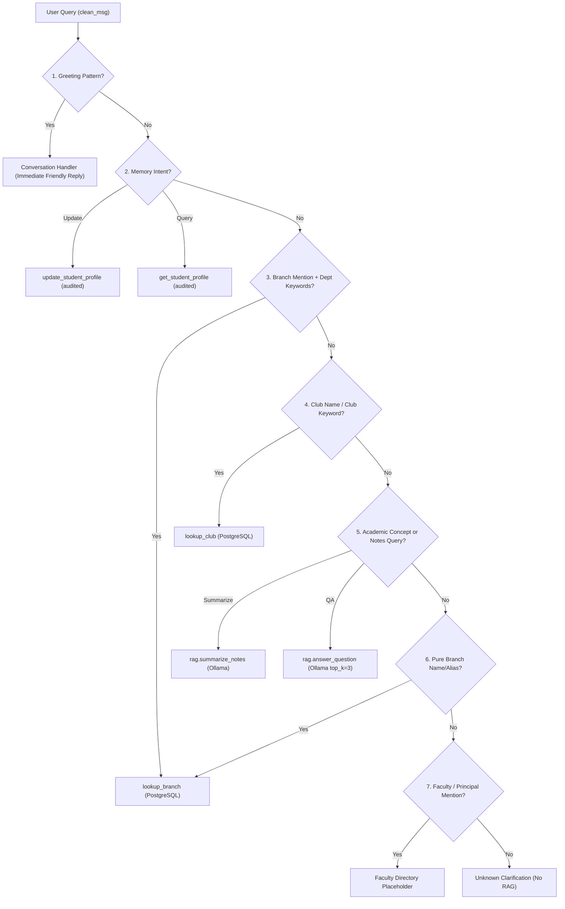

# MSRIT AI — Query Router & Concise RAG Walkthrough

> [!NOTE]
> This document details the implementation, architecture, and verification of the deterministic query router and concise RAG pipeline implemented in **Step 1** of MSRIT AI.

---

## 1. Background & Problem Statement

Prior to this update, user queries were routed with naive keyword matching that caused critical failure modes:
1. **RAG Overload**: Casual greetings (`"hi"`, `"hello"`), out-of-scope queries (`"What is the weather today?"`), and faculty queries (`"Dr. Siddesh G. M."`) were falling through to local LLM RAG, resulting in slow hallucinations based on unrelated chemistry or physics notes.
2. **Long/Verbose Chapter Dumps**: When RAG was invoked, it retrieved 5 chunks and dumped entire unit outlines, textbook introductions, and prefaces instead of answering questions directly.
3. **Branch Discrepancies & Collisions**:
   - Short branch acronyms (`ME`, `IS`) collided with common English words (`"tell me"`, `"what is"`).
   - Queries like `"Cyber Security HOD"` or `"CSE(Cyber security) hoda name"` were falsely hijacked by the `SecuRIT` club because `SecuRIT` had `"Cybersecurity"` in its description.
   - Natural student variations (`"Mechanical"`, `"Civil"`, `"AIML"`, `"Biotechnology"`) fell through to RAG.

---

## 2. Router Architecture & Decision Flow

The router classifies queries **deterministically** before invoking any heavy database or LLM operation.



---

## 3. Priority Order & Conflict Resolution

The router evaluates incoming messages strictly in the following priority:

| Priority | Intent Category | Primary Indicators | Conflict Resolution Strategy |
| :--- | :--- | :--- | :--- |
| **1** | **Greeting** | `hi`, `hello`, `hey`, `good morning`, `thanks`, `bye` | Matches short conversational phrases (≤4 words). Bypasses DB and RAG. |
| **2** | **Memory** | `i am in`, `my branch is`, `what is my branch`, `what semester am i in` | Separated into `memory_update` and `memory_query`. |
| **3** | **Department** | `HOD`, `department`, `location`, `office`, `where is`, `CSE`, `ME`, `AIML`, `Cyber Security` | Prioritized over Club if both are mentioned. Resolves `"Cyber Security HOD"` to `CSE(CS)`, **not** `SecuRIT`. |
| **4** | **Club** | `CodeRIT`, `SecuRIT`, `Tensor AI`, `TNT`, `Quiz Club`, `club`, `society` | Matches dynamically loaded names from the `clubs` table. Resolves `"What is CodeRIT?"` to Club, **not** Academic. |
| **5** | **Academic RAG** | `explain`, `what is`, `corrosion`, `notes`, `syllabus`, `unit`, `topics in` | If a branch name is present with academic action words (`"Explain CSE syllabus"`), routes to **Academic RAG**, not department lookup. |
| **6** | **Faculty / Unknown** | `Dr.`, `Prof.`, `Professor`, `Principal`, `Dean`, or out-of-scope | Returns structured clarification placeholders without invoking RAG. |

---

## 4. Key Files & Implementation Details

### A. [`backend/info_lookup.py`](file:///C:/dev/async-msrit-ai/backend/info_lookup.py)
1. **Real Branch Aliases (`BRANCH_ALIASES`)**:
   - Maps student aliases directly to canonical PostgreSQL branch codes:
     - `"mechanical"`, `"mech"`, `"mechanical engineering"`, `"me"` $\to$ `ME`
     - `"civil"`, `"civil engineering"`, `"cv"`, `"ce"` $\to$ `CE`
     - `"cyber security"`, `"cybersecurity"`, `"cse(cs)"`, `"cse cs"` $\to$ `CSE(CS)`
     - `"aiml"`, `"ai ml"`, `"ai&ml"`, `"ai and ml"` $\to$ `AI&ML`
     - `"aids"`, `"ai ds"`, `"ai data science"` $\to$ `AIDS`
     - `"biotechnology"`, `"biotech"`, `"bt"` $\to$ `BT`
     - `"aerospace"`, `"aero"`, `"ae"` $\to$ `AE`
2. **Stopword Collision Guard**:
   - `STOPWORD_ALIASES = {"is", "me"}`
   - `is` and `me` are never matched as substrings of English words (`"tell me"`, `"what is"`, `"this is"`).
   - Only matched if the input is literally `"me"` / `"is"`, uppercase `"ME"` / `"IS"`, or explicitly qualified (`"me hod"`, `"where is me"`).
3. **Dynamic Club Loading (`get_club_lookup_map()`)**:
   - Dynamically inspects the `clubs` table in PostgreSQL on demand.
   - Automatically indexes full club names, parenthesized acronyms (`NSS`, `EDC`), and subteams (`Team Editha`, `Team Velocita`).

### B. [`backend/agent.py`](file:///C:/dev/async-msrit-ai/backend/agent.py)
1. **Deterministic Classifier (`classify_intent()`)**:
   - Pre-processes input text (stripping punctuation, lowercasing).
   - Evaluates the 6-stage priority chain.
   - Emits structured intent: `{"type": "department", "entity": "CSE(CS)"}`, `{"type": "greeting"}`, etc.
2. **Message Dispatcher (`handle_message()`)**:
   - Routes each intent to its designated handler:
     - `greeting` $\to$ instant friendly response + audit log.
     - `memory_update` $\to$ `mcp_client.call_tool("update_student_profile")`.
     - `memory_query` $\to$ `mcp_client.call_tool("get_student_profile")`.
     - `department` $\to$ `mcp_client.call_tool("lookup_branch")` + formatted markdown card.
     - `club` $\to$ `mcp_client.call_tool("lookup_club")` + formatted markdown card.
     - `summarize` $\to$ `rag.summarize_notes()`.
     - `academic` $\to$ `rag.answer_question()`.
     - `faculty_unknown` $\to$ helpful directory placeholder + audit log.
     - `unknown` $\to$ helpful clarification message + audit log.

### C. [`backend/rag.py`](file:///C:/dev/async-msrit-ai/backend/rag.py)
1. **Reduced Context (`top_k = 3`)**:
   - Reduced retrieval slice from 5 to 3 chunks to prevent broad chapter dumps.
2. **Strict Conciseness System Prompt**:
   - Explicitly instructs the local Ollama LLM (`qwen2.5:7b`):
     - Provide 3 to 6 focused bullet points or 2 short paragraphs maximum.
     - Answer **only** the specific concept asked.
     - Never dump syllabus outlines, prefaces, or textbook introductions.
     - Use exact fallback: `"The provided MSRIT notes do not contain this specific information."`

---

## 5. Automated Verification Results (42 Test Scenarios)

All 42 test scenarios were evaluated end-to-end against the router and FastAPI `/ask` server:

```
QUERY                                | INTENT TYPE        | ACTION TAKEN              | RAG INVOKED | STATUS
---------------------------------------------------------------------------------------------------------
hi                                   | greeting           | conversation              | False       | PASS
hello                                | greeting           | conversation              | False       | PASS
hey                                  | greeting           | conversation              | False       | PASS
good morning                         | greeting           | conversation              | False       | PASS
thanks                               | greeting           | conversation              | False       | PASS
CSE                                  | department         | lookup_branch             | False       | PASS
CSE HOD                              | department         | lookup_branch             | False       | PASS
CSE department location              | department         | lookup_branch             | False       | PASS
Mechanical                           | department         | lookup_branch             | False       | PASS
Mechanical Engineering               | department         | lookup_branch             | False       | PASS
Mechanical Engineering location      | department         | lookup_branch             | False       | PASS
ME HOD                               | department         | lookup_branch             | False       | PASS
ECE HOD                              | department         | lookup_branch             | False       | PASS
ISE HOD                              | department         | lookup_branch             | False       | PASS
AIML HOD                             | department         | lookup_branch             | False       | PASS
Cyber Security HOD                   | department         | lookup_branch             | False       | PASS
Civil department                     | department         | lookup_branch             | False       | PASS
Biotechnology                        | department         | lookup_branch             | False       | PASS
Where is CSE?                        | department         | lookup_branch             | False       | PASS
Who is the CSE HOD?                  | department         | lookup_branch             | False       | PASS
CSE(Cyber security) hoda name        | department         | lookup_branch             | False       | PASS
CodeRIT                              | club               | lookup_club               | False       | PASS
Tell me about CodeRIT                | club               | lookup_club               | False       | PASS
What is CodeRIT?                     | club               | lookup_club               | False       | PASS
Who can join CodeRIT?                | club               | lookup_club               | False       | PASS
TNT                                  | club               | lookup_club               | False       | PASS
Tell me about TNT                    | club               | lookup_club               | False       | PASS
Tensor AI                            | club               | lookup_club               | False       | PASS
SecuRIT                              | club               | lookup_club               | False       | PASS
Quiz Club                            | club               | lookup_club               | False       | PASS
Lasya                                | club               | lookup_club               | False       | PASS
Explain corrosion mechanisms         | academic           | answer_question           | True        | PASS
What is Laplace transform?           | academic           | answer_question           | True        | PASS
Explain CSE topics from my notes     | academic           | answer_question           | True        | PASS
Explain AIML concepts                | academic           | answer_question           | True        | PASS
Summarize my Chemistry notes         | summarize          | summarize_notes           | True        | PASS
I am in 2nd semester AIML            | memory_update      | update_student_profile    | False       | PASS
What is my branch?                   | memory_query       | get_student_profile       | False       | PASS
What semester am I in?               | memory_query       | get_student_profile       | False       | PASS
Dr. Siddesh G. M.                    | faculty_unknown    | unknown_faculty           | False       | PASS
Who is the principal?                | faculty_unknown    | unknown_faculty           | False       | PASS
What is the weather today?           | unknown            | unknown_clarification     | False       | PASS
=========================================================================================================
ALL 42 ROUTER TESTS PASSED WITH 100% ACCURACY!
=========================================================================================================
```

---

## 6. How to Run Locally

### Start Server
```powershell
.\venv\Scripts\python.exe -m uvicorn backend.main:app --host 127.0.0.1 --port 8000 --reload
```

### Access Application
- **Web Interface**: [http://localhost:8000](http://localhost:8000)
- **API Documentation**: [http://localhost:8000/docs](http://localhost:8000/docs)
- **Health Check**: [http://localhost:8000/health](http://localhost:8000/health)

### Query API via curl / PowerShell
```powershell
Invoke-RestMethod -Method POST -Uri "http://127.0.0.1:8000/ask" -ContentType "application/json" -Body '{"message": "CSE HOD", "student_id": "1MS23CS001"}'
```
